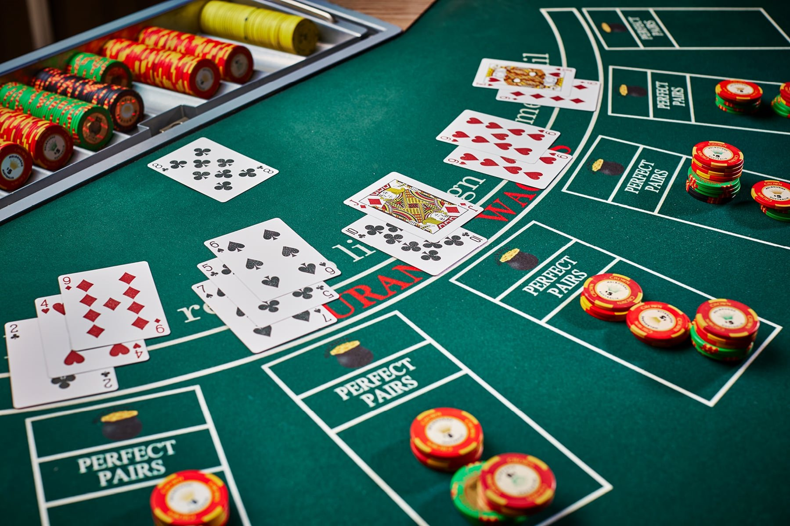
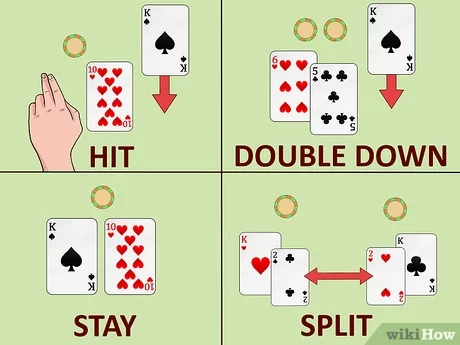
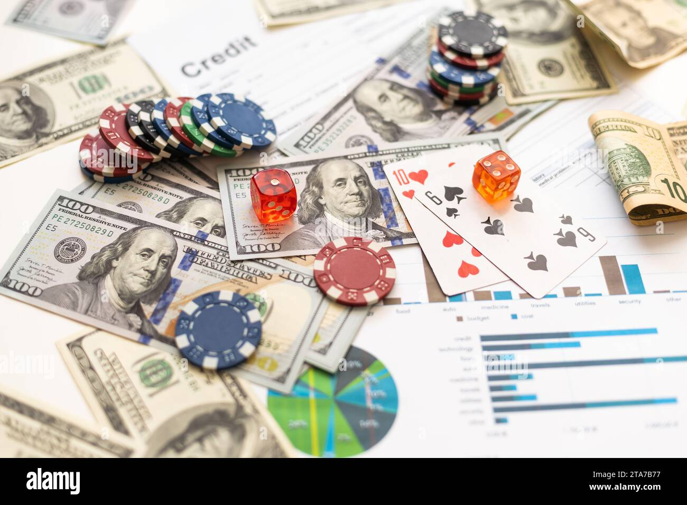

# BlackJack

## Que es el BlackJack ?

El Blackjack, también conocido como 21, es uno de los juegos de cartas más populares en los casinos de todo el mundo. Su origen se remonta al siglo XVII en Francia, y desde entonces ha evolucionado en diversas variantes.

## Como se juega

1. Preparación: El juego se juega con una baraja de 52 cartas (o varias, dependiendo de la mesa). Cada jugador apuesta una cantidad de fichas antes de que se repartan las cartas.

2. Reparto inicial: El crupier reparte dos cartas boca arriba a cada jugador y se reparte a sí mismo una carta boca arriba y una boca abajo (conocida como carta tapada o "hole card").

3. Valor de las cartas: Las cartas numéricas (2 al 10) tienen el valor de su número, las cartas faciales (J, Q, K) valen 10 puntos cada una, y el As puede valer 1 u 11 puntos, según convenga al jugador.

4. Jugada del jugador: Cada jugador, en su turno, decide si pedir más cartas (hit) para acercarse a 21 o quedarse con su mano actual (stand). También puede optar por otras jugadas especiales.

5. Jugada del crupier: Después de que todos los jugadores hayan tomado sus decisiones, el crupier revela su carta tapada y juega según unas reglas preestablecidas. Generalmente, el crupier debe pedir carta hasta alcanzar una puntuación de al menos 17, momento en el que se planta.

6. Determinación del ganador: Se comparan las manos de los jugadores con la del crupier. El jugador gana si su mano tiene un valor más alto que la del crupier y no supera 21, o si el crupier se pasa de 21. Si el jugador y el crupier tienen el mismo valor, se considera un empate (push),

## Jugadas especiales del jugador

1. Double down: El jugador puede doblar su apuesta después de recibir sus dos primeras cartas y pedir una carta adicional.

2. Split: Si el jugador tiene dos cartas del mismo valor, puede dividirlas en dos manos separadas y recibir una carta adicional en cada una.

3. Surrender: Algunos casinos permiten rendirse, lo que significa que el jugador puede abandonar la mano y recuperar la mitad de su apuesta.

## Pago de las apuestas

Pago de las apuestas: Si el jugador gana, se le paga el valor de su apuesta según las reglas de la mesa (generalmente 1:1). Si el jugador obtiene un Blackjack (una mano inicial de 21 con un As y una carta de valor 10), el pago suele ser de 3:2.

## Estrategia basica

Existe una estrategia básica matemáticamente óptima para jugar al Blackjack, que minimiza la ventaja de la casa. Esta estrategia se basa en las probabilidades de que salgan determinadas cartas y en las reglas específicas de la mesa. Por ejemplo, en qué situaciones pedir carta, plantarse, doblar la apuesta, etc. esta estrategia se puede ver en la siguiente foto.

# Beneficios 

## Mas informacion:

+ [Informacion del BlackJack](https://es.wikipedia.org/wiki/Blackjack)
+ [Pagina para jugar](https://ofertas.pba.betsson.bet.ar/ag/bono-de-bienvenida-casino?from=ppc_adwords&kw=slots%20online&cpn=20851743102&&from=ppc_adwords&gclid=CjwKCAjw9cCyBhBzEiwAJTUWNYXpMQw-LAnnN1AdbsvOI0eZFWWYPUEYNBZy7nda0F5QPrg7hGyoYxoCxs4QAvD_BwE&gclsrc=aw.ds)
+ [Estrategias](https://www.casino.org/es/blackjack/estrategia/)
+ [Funcionamiento](https://www.sportium.es/reglascasino/reglasblackjack#:~:text=El%20blackjack%20cl%C3%A1sico%20se%20juega,de%201%20o%20de%2011.)
+ [Ayuda a dejar la adiccion al juego](https://www.sindrome-adicciones.es/blog/ludopatia/como-dejar-de-ser-ludopata/)