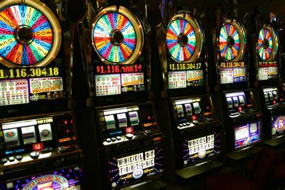
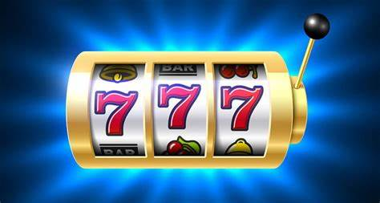

# Slots Online

## ¿Qué son los Slots Online?

Los slots online, también conocidos como tragamonedas en línea, son versiones digitales de las clásicas máquinas tragamonedas que se encuentran en los casinos físicos. Estas versiones electrónicas permiten a los jugadores disfrutar de la experiencia de los slots desde la comodidad de su hogar a través de computadoras, tablets o smartphones.

## Cómo Funcionan?

1. Generador de Números Aleatorios (RNG): 
    El corazón de cualquier slot online es el RNG (Random Number Generator), que asegura que cada giro sea completamente aleatorio y justo.

2. Carretes y Líneas de Pago: 
    Los slots tienen carretes (reels) que giran y líneas de pago (paylines) donde deben coincidir ciertos símbolos para ganar. La cantidad de carretes y líneas de pago puede variar según el juego.

3. Símbolos y Temas: 
    Los juegos de slots online suelen tener una variedad de símbolos, que pueden incluir comodines (wilds), scatters y otros íconos especiales que activan bonificaciones. Además, vienen en una gran diversidad de temas, desde frutas clásicas hasta aventuras temáticas y franquicias populares.

## Tipos de Slots

1. Clásicos: 
    Basados en las máquinas tragamonedas originales con 3 carretes y simples líneas de pago.

2. Video Slots:
     Modernos, con 5 o más carretes, múltiples líneas de pago, gráficos avanzados y animaciones.

3. Progresivos:
     Ofrecen jackpots acumulativos que crecen con cada apuesta realizada en el juego hasta que alguien gana el premio.

## Ventajas de Jugar Slots Online

1. Accesibilidad: 
    Disponibles 24/7 desde cualquier dispositivo con conexión a Internet.

2. Variedad de Juegos: 
    Infinidad de opciones temáticas y mecánicas de juego para todos los gustos.

3. Bonificaciones: 
    Promociones atractivas como giros gratis, bonos de bienvenida y programas de lealtad.

4. Comodidad y Flexibilidad: 
    Juega desde casa o en movimiento, sin necesidad de desplazarte a un casino físico.

## Consejos para Jugar Slots Online

1. Establece un Presupuesto: 
    Decide cuánto estás dispuesto a gastar antes de empezar a jugar y respétalo.

2. Aprovecha las Bonificaciones: 
    Utiliza las ofertas y promociones para maximizar tus oportunidades de juego.

3. Conoce el Juego: 
    Familiarízate con las reglas, símbolos especiales y funciones de bonificación del slot que eliges.

4. Juega Responsablemente: 
    Los slots son un juego de azar; no apuestes más de lo que puedes permitirte perder y evita perseguir pérdidas.

## Seguridad y Legalidad

1. Licencias: 
Juega solo en casinos online que estén debidamente licenciados y regulados por autoridades reconocidas, como la Malta Gaming Authority o la UK Gambling Commission.

2. Protección de Datos:
 Asegúrate de que el sitio tenga medidas de seguridad adecuadas, como el cifrado SSL, para proteger tu información personal y financiera.

3. Juego Responsable: 
Busca sitios que promuevan el juego responsable y ofrezcan herramientas para controlar el gasto, como límites de depósito y autoexclusión.

## Conclusión

Los slots online ofrecen una forma emocionante y accesible de disfrutar de los juegos de azar. Con una amplia variedad de opciones y la conveniencia de jugar desde cualquier lugar, han ganado popularidad entre los jugadores de todo el mundo. Sin embargo, es fundamental jugar de manera responsable y elegir plataformas seguras y reguladas para una experiencia de juego positiva y segura.

## Mas informacion:

+ [INFORMACION SOBRE LOS SLOTS](https://en.wikipedia.org/wiki/Slot_machine)

+ [PAGINA DE SLOTS](https://www.bplay.bet.ar/slots/)

+ [TECNICAS PARA LOS SLOTS](https://apuestasonline.net/estrategias/trucos-slots-online/#:~:text=11%20trucos%20f%C3%A1ciles%20para%20jugar%20a%20las%20slots,el%20presupuesto%20que%20puedes%20gastar%20...%20More%20items)

+ [FUNCIAMIENTO](https://electropreguntas.com/que-es-un-slot-y-para-que-sirve-todos-sus-usos/#:~:text=Los%20slots%20%28tambi%C3%A9n%20llamados%20ranuras%29%20son%20dispositivos%20de,adem%C3%A1s%2C%20almacenar%20informaci%C3%B3n%20procedente%20de%20los%20dispositivos%20externos.)

+ [AYUDA A LUDOPATAS](https://psicologiaymente.com/drogas/como-ayudar-persona-con-ludopatia)